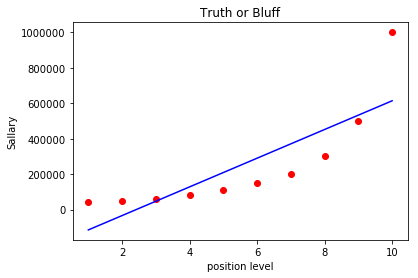
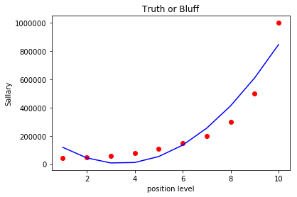
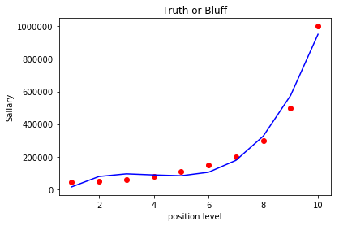
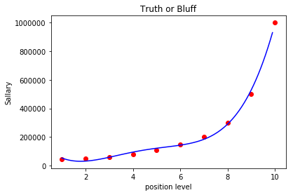
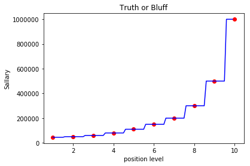
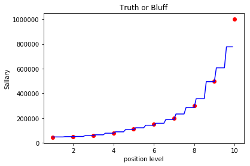

# Predect-Salary-depend-on-position
Predect Salary depend on position ;train linear,polynomial regretion model and suport vector regression ,decision tree regression and evaluate evry model to choose the good model and use it
<html>
<body>

<h2>linear regression fitting</h2>

<h2>polynomial regression 2nd degree fitting</h2>

<h2>polynomial regression 3rd degree fitting</h2>

<h2>polynomial regression 4th degree fitting</h2>

<h2>Decision tree regression fitting</h2>

<h2>Random Forest regression fitting</h2>

</body>
</html>
